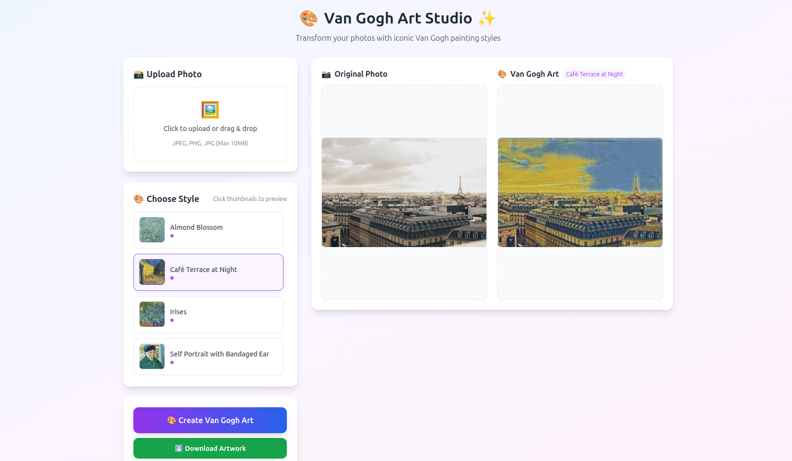
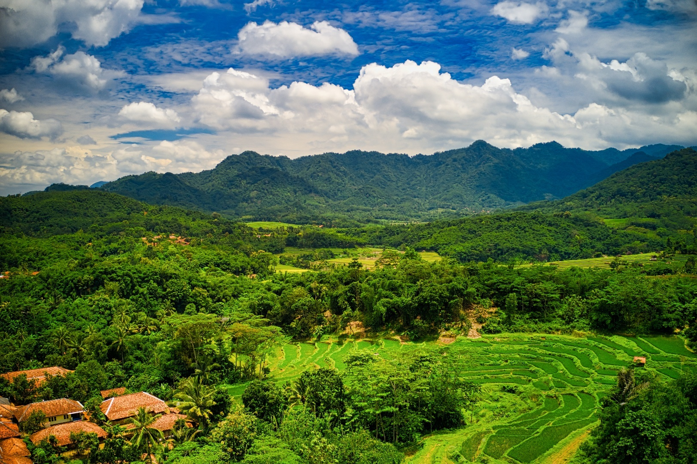
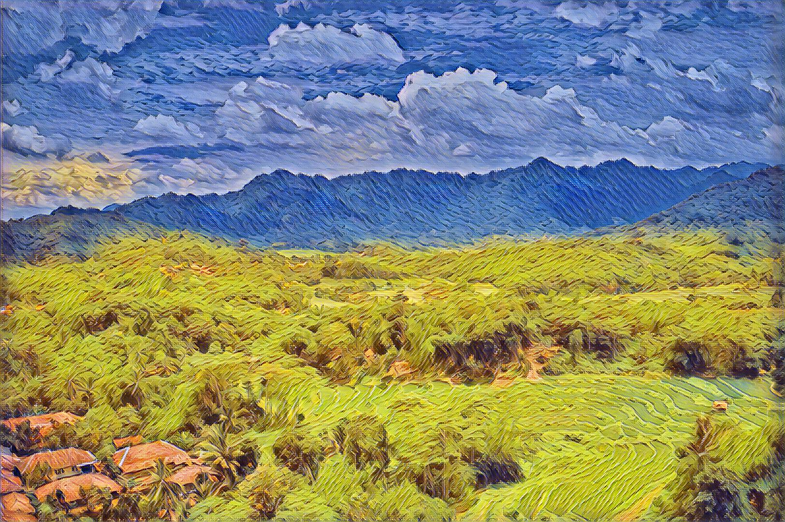

# 🎨 Van Gogh Art Studio

[](https://www.tensorflow.org/)
[](https://fastapi.tiangolo.com/)
[](https://www.python.org/)
[](https://www.docker.com/)

Transform your photos into stunning Van Gogh-style masterpieces using deep learning and neural style transfer. Experience the magic of AI art generation with just one click!



<div align="center">
  <table>
    <tr>
      <td align="center"><strong>Content</strong></td>
      <td align="center"><strong>Style</strong></td>
      <td align="center"><strong>Result</strong></td>
    </tr>
    <tr>
      <td align="center">
        
        <br>
      </td>
      <td align="center">
        
        <br>
      </td>
      <td align="center">
        
        <br>
      </td>
    </tr>
  </table>
</div>

## ✨ Features

- 🎨 **10+ Van Gogh Styles** - Starry Night, Sunflowers, Almond Blossom, and more
- 🖼️ **Easy Upload** - Drag & drop interface for seamless photo upload
- ⚡ **Real-time Processing** - Watch as your photo transforms in real-time
- 📱 **Responsive Design** - Works perfectly on desktop and mobile
- 💾 **Instant Download** - Download high-resolution artwork instantly
- 🐳 **Docker Powered** - One-command deployment, no setup required

## 🚀 Quick Start

### Run with Docker (Recommended)

```bash
docker run -p 8000:8000 trongkhanh083/van-gogh-studio
```

## 🛠️ For Developers

### Clone the repository
```
git clone https://github.com/trongkhanh083/neural-style-transfer.git
cd neural-style-transfer
```
### Create conda environment
```
conda create -n fast-nst tensorflow-gpu==2.1.0
conda activate fast-nst
```

### Install dependencies
```
pip install -r requirements.txt
```

### Run the application
```
python main.py
```
### Build the image
```
docker build -t van-gogh-studio .
```

### Run locally built image
```
docker run -p 8000:8000 van-gogh-studio
```

## 📝 License
  - This project is licensed under the MIT License.

## 🙏 Acknowledgments
  - Van Gogh's artwork for the incredible inspiration
  - FastAPI for the robust web framework
  - Docker for seamless deployment
  - The open-source community for various AI/ML libraries
